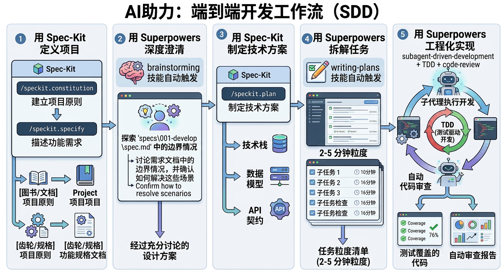

# Superpowers Bridge for Spec-Kit

**Specification-Driven Development with Superpowers**

Superpowers Bridge is a [spec-kit](https://github.com/github/spec-kit) extension that
integrates [obra/superpowers](https://github.com/obra/superpowers) agent capabilities
into the spec-kit development workflow. It works with any spec-kit compatible coding
agent, including [Claude Code](https://docs.anthropic.com/en/docs/agents-and-tools/claude-code),
[Codex CLI](https://github.com/openai/codex) and others.

Spec-kit provides the document structure and governance (constitution, specifications, plans, tasks).
Superpowers provides deep clarification (brainstorming), intelligent task decomposition (writing-plans),
and engineering execution discipline (TDD, subagent-driven development, code review).

## Architecture


The workflow orchestrates 6 phases — from project definition through engineering implementation — with spec-kit handling governance artifacts and superpowers providing intelligent clarification, decomposition, and execution capabilities.

## Installation

### Via Spec-Kit CLI (Recommended)

```bash
specify extension add superspec
```

### From Source

```bash
# Clone the repository
git clone https://github.com/WangX0111/superspec.git

# Install via spec-kit from local path
specify extension add ./superspec --dev
```

### As an Agent Skill

If you're using a coding CLI agent (Claude Code, Codex CLI, etc.) and want to use
this as a skill rather than a spec-kit extension, symlink it:

```bash
# Claude Code
ln -sf "$(pwd)/superspec" ~/.claude/skills/superspec
# Codex CLI
ln -sf "$(pwd)/superspec" ~/.codex/skills/superspec
# Other agents (common convention)
ln -sf "$(pwd)/superspec" ~/.agents/skills/superspec
```

### Optional: Install Superpowers

Superpowers Bridge works standalone, but for enhanced capabilities install superpowers skills:

```bash
# Install obra/superpowers (see their repo for latest instructions)
# Skills should be placed in ~/.agents/skills/ or .agents/skills/
```

## Commands

| Command | Description |
|---------|-------------|
| `/speckit.superspec.status` | Show current progress and suggest next step |
| `/speckit.superspec.brainstorm` | Deep-dive edge cases and refine a spec document |
| `/speckit.superspec.tasks` | Generate phased task breakdown with execution markers |
| `/speckit.superspec.execute` | Orchestrate implementation with TDD + subagents |
| `/speckit.superspec.review` | Run code review against spec requirements |

> **Note**: This extension adds 5 commands on top of the core spec-kit commands
> (`/speckit.constitution`, `/speckit.specify`, `/speckit.plan`, `/speckit.tasks`,
> `/speckit.checklist`). The core commands are provided by spec-kit itself.

## Resumable by Design

All project state is persisted in `.specify/` as plain-text markdown and YAML files.
When a session is interrupted — agent timeout, user leaves, CLI crash — no progress
is lost. Run `/speckit.superspec.status` in a new session to see exactly where you left off:

```
Superspec Project Status
========================
Constitution: Done
Features:
  001-user-auth    [####------] execute (Phase 5/6) — 11/19 tasks done
  002-photo-upload [##--------] brainstorm (Phase 2/6) — 2 open questions

Suggested next step: /speckit.superspec.execute 001
```

Each command automatically detects previous progress and resumes from the
interruption point — skipping completed work, continuing from open questions
or unchecked tasks.

## Getting Started

### 1. Initialize Project Governance

```
/speckit.constitution MyProject
```

This creates the `.specify/` directory structure and interviews you about core principles,
technology stack, and quality gates.

### 2. Write Your First Spec

```
/speckit.specify "User authentication with email and password"
```

This creates a feature specification at `.specify/specs/001-user-authentication/spec.md`
with user stories, requirements, and success criteria.

### 3. Brainstorm Edge Cases

```
/speckit.superspec.brainstorm .specify/specs/001-user-authentication/spec.md
```

The agent asks probing questions one at a time to discover boundary conditions, error
scenarios, security concerns, and UX pitfalls you may not have considered.

### 4. Plan and Execute

```
/speckit.plan                            # Create technical implementation plan
/speckit.superspec.tasks               # Generate task breakdown with execution markers
/speckit.superspec.execute             # Implement with TDD discipline and checkpoints
/speckit.superspec.review              # Verify implementation against spec
```

## Project Structure

After initialization, your project will contain:

```
your-project/
├── .specify/
│   ├── memory/
│   │   └── constitution.md      # Project governance principles
│   ├── superpowers.yml          # Superpowers detection status (auto-managed)
│   ├── specs/
│   │   └── 001-feature-name/
│   │       ├── spec.md          # Feature specification
│   │       ├── plan.md          # Implementation plan
│   │       ├── tasks.md         # Task breakdown
│   │       ├── progress.yml     # Phase progress tracker (auto-managed)
│   │       └── checklist-*.md   # Generated checklists
│   └── templates/               # Document templates
└── ... (your source code)
```

## Workflow

```
Constitution → Specify → Brainstorm → Plan → Tasks → Execute → Review
                            ↑     ↓
                            └─────┘  (iterate until spec is solid)
```

Each phase has an explicit gate — prerequisites are verified before proceeding.
Human checkpoints ensure you control when to advance.

## Superpowers Integration

When obra/superpowers skills are installed, superspec automatically detects and uses them:

| Superspec Command | Enhanced By | Fallback |
|-------------------|-------------|----------|
| `brainstorm` | `brainstorming` skill | Built-in questioning protocol |
| `tasks` | `writing-plans` skill | Template-based decomposition |
| `execute` | `executing-plans` + `subagent-driven-development` + `test-driven-development` | Sequential execution with manual confirmation |
| `review` | `requesting-code-review` skill | Built-in review checklist |

See [superpowers-bridge.md](references/superpowers-bridge.md) for full integration details.

## Contributing to the Spec-Kit Extension Registry

To submit this extension to the [spec-kit community catalog](https://github.com/github/spec-kit/tree/main/extensions):

1. **Fork** the `github/spec-kit` repository
2. **Add an entry** to `extensions/catalog.community.json`:

```json
{
  "id": "superpowers",
  "name": "Superpowers Bridge",
  "version": "1.0.0",
  "description": "Bridges spec-kit with obra/superpowers capabilities (brainstorming, writing-plans, TDD, subagent-driven-development, code-review)",
  "author": "Superspec Contributors",
  "repository": "https://github.com/WangX0111/superspec",
  "verified": false,
  "tags": ["superpowers", "brainstorming", "tdd", "code-review", "subagent", "workflow"]
}
```

3. **Add a row** to the Community Extensions table in the spec-kit `README.md`
4. **Submit a Pull Request** using the extension submission template
5. Allow 3-7 business days for automated checks and manual review

See the full [Extension Publishing Guide](https://github.com/github/spec-kit/blob/main/extensions/EXTENSION-PUBLISHING-GUIDE.md) for details.

## License

MIT

---

# Superpowers Bridge（中文说明）

**规格驱动开发 + 超级能力**

Superpowers Bridge 是一个 [spec-kit](https://github.com/github/spec-kit) 扩展，将
[obra/superpowers](https://github.com/obra/superpowers) 代理能力集成到 spec-kit
开发工作流中。它兼容所有支持 spec-kit 的编程代理，包括
[Claude Code](https://docs.anthropic.com/en/docs/agents-and-tools/claude-code)、
[Codex CLI](https://github.com/openai/codex) 等。

Spec-kit 提供文档结构和治理（宪章、规格、计划、任务）。
Superpowers 提供深度澄清（头脑风暴）、智能任务拆解（计划编写）和工程执行纪律（TDD、子代理驱动开发、代码审查）。

## 架构概览



工作流编排 6 个阶段——从项目定义到工程实现——spec-kit 负责治理文档，superpowers 提供智能澄清、任务拆解和执行能力。

## 安装

### 通过 Spec-Kit CLI（推荐）

```bash
specify extension add superspec
```

### 从源码安装

```bash
# 克隆仓库
git clone https://github.com/WangX0111/superspec.git

# 从本地路径安装
specify extension add ./superspec --dev
```

### 作为代理技能安装

如果你使用 Claude Code、Codex CLI 等，希望将其作为技能而非 spec-kit 扩展使用：

```bash
# Claude Code
ln -sf "$(pwd)/superspec" ~/.claude/skills/superspec
# Codex CLI
ln -sf "$(pwd)/superspec" ~/.codex/skills/superspec
# 其他代理（通用约定）
ln -sf "$(pwd)/superspec" ~/.agents/skills/superspec
```

### 可选：安装 Superpowers

Superpowers Bridge 可以独立工作，但安装 superpowers 技能可获得增强能力：

```bash
# 安装 obra/superpowers（具体方式请参见其仓库）
# 技能应放置在 ~/.agents/skills/ 或 .agents/skills/
```

## 命令列表

| 命令 | 说明 |
|------|------|
| `/speckit.superspec.status` | 显示当前进度并建议下一步操作 |
| `/speckit.superspec.brainstorm` | 深入探索边界情况，完善规格文档 |
| `/speckit.superspec.tasks` | 生成分阶段任务清单（含执行标记） |
| `/speckit.superspec.execute` | 以 TDD + 子代理编排方式执行实现 |
| `/speckit.superspec.review` | 对照规格进行代码审查 |

> **注意**：此扩展在 spec-kit 核心命令（`/speckit.constitution`、`/speckit.specify`、
> `/speckit.plan`、`/speckit.tasks`、`/speckit.checklist`）基础上增加 5 个命令。
> 核心命令由 spec-kit 自身提供。

## 可中断恢复

所有项目状态以纯文本（Markdown + YAML）持久化在 `.specify/` 目录中。
会话中断时——代理超时、用户离开、CLI 崩溃——不会丢失任何进度。
在新会话中运行 `/speckit.superspec.status` 即可查看中断点：

```
Superspec 项目状态
==================
宪章: 已完成
Superpowers:  brainstorming (已检测), writing-plans (未安装)

功能:
  001-user-auth    [####------] 执行中 (阶段 5/6) — 11/19 任务完成
  002-photo-upload [##--------] 头脑风暴 (阶段 2/6) — 2 个待解决问题

建议下一步: /speckit.superspec.execute 001
```

每个命令会自动检测之前的进度并从中断点恢复——跳过已完成的工作，从未解决的问题或未完成的任务继续。

## 快速开始

### 1. 初始化项目治理

```
/speckit.constitution 我的项目
```

创建 `.specify/` 目录结构，并引导你定义核心原则、技术栈和质量门禁。

### 2. 编写第一个功能规格

```
/speckit.specify "用户邮箱密码登录认证"
```

在 `.specify/specs/001-user-authentication/spec.md` 创建功能规格，包含用户故事、需求和成功标准。

### 3. 头脑风暴边界情况

```
/speckit.superspec.brainstorm .specify/specs/001-user-authentication/spec.md
```

代理逐个提出探索性问题，发现你可能没有想到的边界条件、错误场景、安全隐患和用户体验陷阱。

### 4. 规划与执行

```
/speckit.plan                            # 创建技术实现方案
/speckit.superspec.tasks               # 生成任务拆解（含执行标记）
/speckit.superspec.execute             # 以 TDD 纪律和检查点方式实现
/speckit.superspec.review              # 对照规格验证实现
```

## 工作流

```
宪章 → 规格 → 头脑风暴 → 计划 → 任务 → 执行 → 审查
                ↑     ↓
                └─────┘（反复迭代直到规格完善）
```

每个阶段都有明确的门禁——在推进前验证前置条件。人工检查点确保你控制推进节奏。

## Superpowers 集成

当安装了 obra/superpowers 技能时，Superpowers Bridge 会自动检测并使用：

| 命令 | 增强来源 | 降级方案 |
|------|----------|----------|
| `brainstorm` | `brainstorming` 技能 | 内置提问协议 |
| `tasks` | `writing-plans` 技能 | 基于模板的拆解 |
| `execute` | `executing-plans` + `subagent-driven-development` + `test-driven-development` | 顺序执行+手动确认 |
| `review` | `requesting-code-review` 技能 | 内置审查清单 |

详见 [superpowers-bridge.md](references/superpowers-bridge.md)。

## 贡献到 Spec-Kit 扩展目录

要将此扩展提交到 [spec-kit 社区目录](https://github.com/github/spec-kit/tree/main/extensions)：

1. **Fork** `github/spec-kit` 仓库
2. **添加条目**到 `extensions/catalog.community.json`
3. **添加一行**到 spec-kit `README.md` 的社区扩展表
4. **提交 Pull Request**（使用扩展提交模板）
5. 等待 3-7 个工作日的自动化检查和人工审核

详见 [扩展发布指南](https://github.com/github/spec-kit/blob/main/extensions/EXTENSION-PUBLISHING-GUIDE.md)。

## 许可证

MIT
